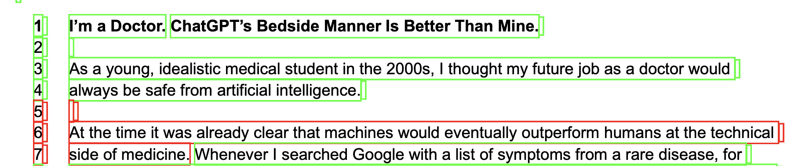

# Testing Automated Encoding for CommAI :bookmark_tabs: :scissors:

**To view results, go to the output folder and open processed pdfs.** This document details the program used to produce these encoding-visualizations.

```
category_colors = {
    "Opportunity": (0, 255, 0),  # Green
    "Risk": (255, 0, 0),         # Red
    "Replace": (255, 192, 203),  # Pink
    "Complement": (255, 255, 0), # Yellow
}
```



:exclamation: _Note: the program is not perfect. Here is an encoding for **Risk** although **Replace** as in "replacing humans with AI" would more closely fit._

## Overview

This script processes all PDFs in a specified input folder to classify and highlight sentences based on their semantic similarity to predefined categories (we chose Opportunity, Risk, Replace and Complement for our group project). It uses pre-trained word embeddings from spaCy to represent sentences and category keywords as vectors. Each sentence is compared to the category vectors using cosine similarity to identify its most relevant category. Sentences with high similarity scores are highlighted in the PDF with category-specific colors. The processed PDFs are saved in an output folder with the same filenames, enabling batch semantic analysis and visualization of text data.

## Main Idea :low_brightness:

Here we aggregate the meanings of multiple related keywords into one vector, potentially enabling broader and more robust semantic matching, most likely at the cost of nuance. We then compare sentence vectord to category vectors as numerical representations (embeddings) of their respective semantics in the same vector space. (Sentence embeddings are also typically computed as an aggregate, but we did not research this for the chosen NLP packages.)

## Approach :triangular_ruler: 

Our test set of seven documents (the outputs) look promising and will be compared to manual encoding work for our presentation.

## Setup

Create a virtual environment (best with venv) and add the `PyMuPDF` and `spacy` packages with `pip install`. Then, to have the embedding model loaded:

```
python -m spacy download en_core_web_md
```

Categories/labels can be added as needed in the chosen codings, as long as they are saved with their name and `.txt` ending in the root directory. You should be able to run `python test_encoding.py` to execute the script in your virtual environment.